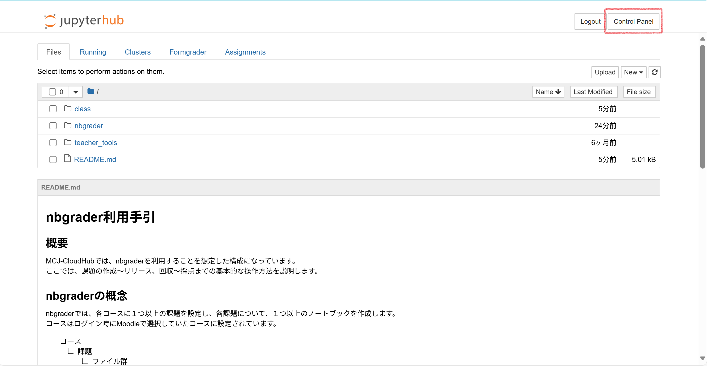
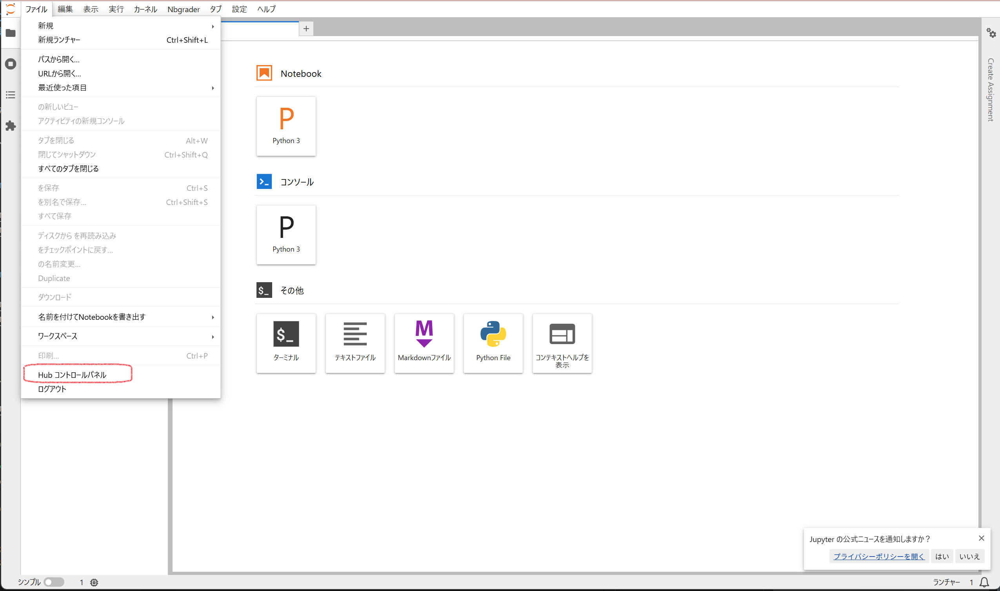
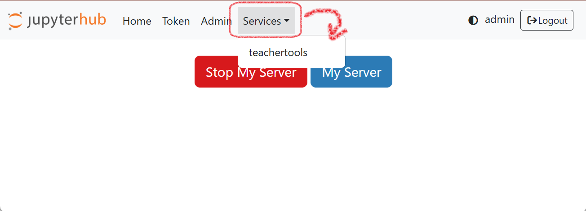
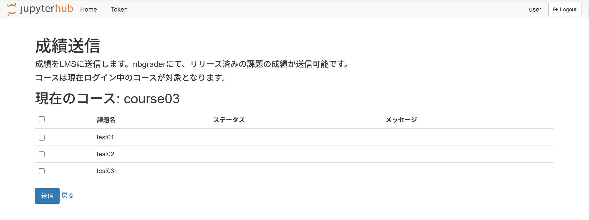

# 教員向けツール

## LMSへの成績反映

nbgraderでの採点結果を LMS（Moodle）に送信できます。  
送信対象にするかどうかは、`nbgrader` で設定した課題ごとに選択します。  

成績送信画面は、JupyterHub の `Control Panel` から管理画面を開き、画面上部の `Services` ドロップダウン内にある `teachertools` リンクから開きます。

1. `Control Panel`にアクセスします。  

    アクセス手順は使用しているUIによって異なります。  

    

Jupyter Notebook UIの場合

    

    

    

JupyterLab UIの場合

    

    

1. `teachertools` リンクから成績送信画面を開きます。  

    

1. 成績送信画面で、LMS に登録する課題にチェックを付けて送信ボタンを押します。

    

!!! warning

     成績送信前に、以下を確認してください。

     1. 成績情報を送信するたびに、対象課題の LMS 上の成績は全て上書きされます。

         LMS 側で手動編集した成績も、次回送信時に置き換わる点に注意してください。

     2. LMS へ登録される課題名は、`nbgrader` の課題名がそのまま使われます。

         1 つのコースに複数の MCJ-CloudHub 環境を連携する場合は、課題名が重複しないように設定してください。

     3. 成績を送信すると、学生はすぐに LMS 上で自分の成績を参照できます。